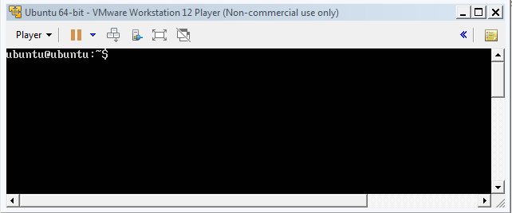
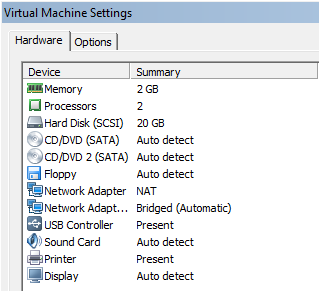
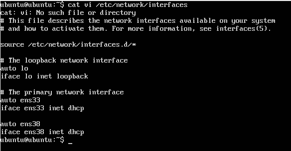
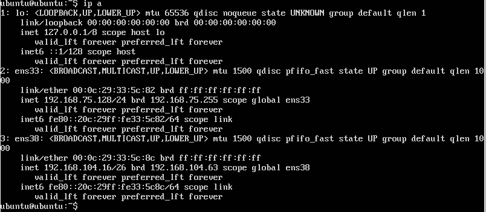
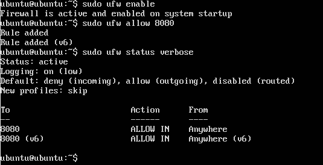
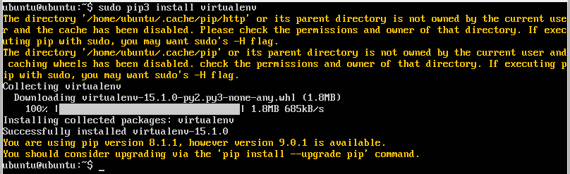
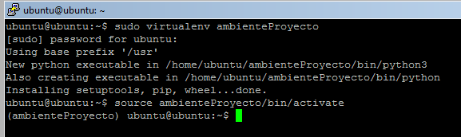
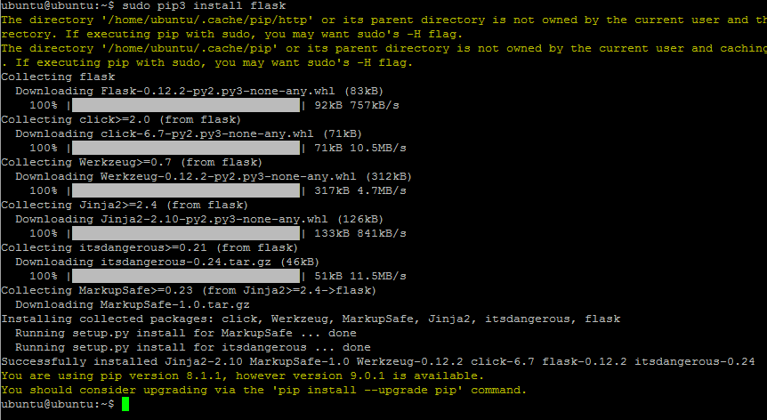

## Miniproyecto Sistemas Operativos

**Universidad ICESI**  
**Curso:** Sistemas Operativos  
**Docente:** Daniel Barragán C.  
**Tema:**  Servicios web  
**Correo:** daniel.barragan at correo.icesi.edu.co  
**Estudiantes:** Jorge Eliecer Castaño Valencia, Alexis Cordoba.  
**Codigos:** A00315284, A00232548.

## Objetivos
* Desplegar una aplicación en un servidor que ejecuta el sistema operativo Linux
* Realizar los ajustes y depuración necesarios para desplegar una
aplicación en Linux
* Realizar aplicaciones para obtener información del sistema operativo

## Descripción
Para el despliegue de una aplicación en un servidor se requiere conocer los procedimientos necesarios relacionados con la configuracion de las interfaces de red, ajustes de seguridad, instalación de dependencias, usuarios y herramientas de depuracíon del sistema operativo.

El siguiente proyecto consiste en el despliegue de una aplicación web para obtener información del sistema operativo (La aplicación debe permitir consulta uso de CPU, memoria y espacio en disco). Para este propósito se debe emplear el sistema operativo Ubuntu Server 16.04, el microframework flask y ambientes virtuales.

<p align="center">
  
</p>

## Actividades
* Nombre y código de todos los integrantes del grupo (máximo 3) (5%)
* Ortografía y redacción (5%)
* Descripción breve de los pasos para cumplir con lo solicitado
  * Sistema operativo Ubuntu Server 16.04 (10%)
  * Configuración de interfaces de red (10%)
  * Configuración de puertos (10%)
  * Instalación de dependencias (10%)
  * Creación de ambientes virtuales (10%)
  * Aplicación en Python (10%)
  * Validación de la ejecución del servicio (netstat) (10%)
* Pruebas de la solución a través de capturas de pantalla. Puede emplear si lo desea una herramienta de captura de pantalla a formato .gif (10%)
* El informe debe ser entregado en formato pdf a través del moodle y el informe en formato README.md debe ser subido a un repositorio de github. El repositorio de github debe ser un fork de https://github.com/ICESI-Training/so-project y para la entrega deberá hacer un Pull Request (PR) respetando la estructura definida. El código fuente y la url de github deben incluirse en el informe (10%).  

## Desarrollo

**Sistema operativo Ubuntu Server 16.04**  

Lo primero en realizar es la instalacion de ubuntu server. Para ello se instalo *ubuntu-16.04.3-server-amd64* en VMware workstation 12 Player.  

En la instalacion se nos pide definir el nombre y contraseña del usuario root el cual es *ubuntu*.



**Configuración de interfaces de red**

Despues de instalar la maquina virtual, se procedio a realizar la siguiente configuración



Como se puede ver, se configuro un adaptador de red Nat y Bidge. El primero permite a la máquina virtual compartir una conexión a una red física TCP/IP con el sistema operativo host.  El segundo usa un adaptador de red física para conectar la máquina virtual a una red física basada en TCP/IP como equipo independiente.

Luego, se configuro las interfaces de red. Para ello usamos el servicio dhcp para que asigne las direcciones de red automaticamente.



Tales direcciones son:



Para trabajar de una mejor manera entre el equipo, se uso una conexion ssh. Para ello, se instalo el servicio ssh y se habilito el puerto 22 en el firewall para que permitiera realizar la conexion.

```
# sudo apt-get intall openssh-server -y
# sudo ufw allow 22
```

**Configuración de puertos**

Aqui, se habilito el firewall y el puerto 8080 ya que es el que se utilizara para realizar la comunicacion http.

Para ello se usaron los comand:

```
# sudo ufw enable
# sudo ufw allow 8080
```

Y finalmente se verifico que el puerto se halla habilitado.

# sudo ufw status verbose

```

```

**Instalación de dependencias**

Las dependencias que vamos a usar son de Python y las del ambiente virtual. Para ello, se usa los siguiente comandos:
```
 # sudo apt-get install python3-pip
 # sudo pip3 install virtualenv
```


**Creación de ambientes virtuales**

Para crear el ambiente *ambienteProyecto* se uso el siguiente comando:

```
 # sudo virtualenv ambienteProyecto
```

Y para activarlo:

```
# source ambienteProyecto/bin/activate
```



E instalamos el microservice flask 

```
# sudo pip install flask
```




**Aplicación en Python**

Dentro del ambiente creo una carpeta *so-services* y creo el siguiente script (infoSO.py)


## Referencias
* https://www.ubuntu.com/download/server
* https://technet.microsoft.com/es-co/library/ee449441(v=ws.10).aspx
